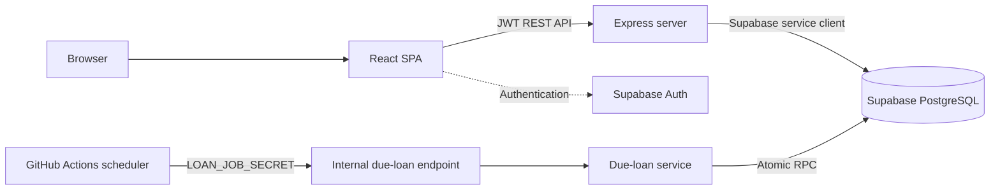

# Finance Tracker

## Overview

Finance Tracker is a personal financial-management application for recording and reviewing:

- transactions, categories, and payment sources;
- monthly budgets and annual summaries;
- loans and authoritative loan-payment accounting;
- spreadsheet imports and an external transaction API;
- shopping lists, tasks, and settings; and
- a LEGO collection with acquisition and transaction-cost metadata.

The application is designed for a personal finance workflow. It is not presented as a multi-tenant SaaS product.

## Current maturity

Development began in early 2026 and the application already has a broad operational feature set. Formal semantic release tracking is only now being introduced.

The repository is preparing for its first formally tracked baseline, **v0.9.0**. That baseline has not yet been tagged or released. Work before it is documented as pre-versioning development history, not as invented semantic releases.

See [Project Status](docs/PROJECT_STATUS.md) for current readiness and known limitations.

## Features

- Dashboard KPIs and monthly financial trends
- Searchable, keyset-paginated transactions
- Direct, itemized, installment, and loan-linked transaction workflows
- Category and payment-source management
- Monthly budgets and annual summaries
- Legacy-compatible and principal-aware loan accounting
- Manual, automatic, irregular, catch-up, adjustment, and early-payoff loan events
- Spreadsheet import profiles and API-based transaction ingestion
- Shopping lists with catalog and checkout workflows
- Tasks linked to transactions or loans
- LEGO purchase allocation, Gift/GWP tracking, collection synchronization, and Rebrickable metadata
- RTL-first Finance v3 interface with light and dark themes

## Architecture at a glance



Primary application flow:

```text
React
  -> Express REST API
    -> Supabase service client
      -> PostgreSQL
```

Node handles HTTP validation, orchestration, pricing and amortization inputs. PostgreSQL owns important atomic financial mutations, loan-summary refreshes, pagination, and dashboard aggregation.

## Repository structure

```text
client/                 React SPA, Finance v3 UI, tests, and Vercel SPA config
server/                 Express API, business services, migrations, and server tests
server/migrations/      Ordered schema history, currently 001 through 015
server/full_schema.sql  Consolidated schema reference
docs/                   Canonical documentation and a retained read-only security audit
.github/workflows/      Daily due-loan scheduler
```

## Technology stack

- React 19, React Router, Axios, Recharts, date-fns, and Lucide React
- Vite 7 with the SWC React plugin
- Plain CSS using Finance v3 design tokens and shared UI components
- Express 5 on Node.js
- Supabase Auth, Supabase JS, and PostgreSQL
- Vitest and Testing Library on the client
- Node's built-in test runner on the server
- XLSX import and Rebrickable metadata integration

## Prerequisites

- Use **Node.js 20.19+** or a currently supported **Node.js 22+** release.
- npm
- Access to a compatible Supabase project for database-backed development

The current package metadata contains older/inconsistent engine and package-version values. Those values are not the authoritative release or runtime contract and will be normalized separately.

## Getting started

### Install

From the repository root:

```bash
npm install
npm install --prefix client
```

The root post-install script installs server dependencies. Installing within `server/` explicitly is also supported:

```bash
npm install --prefix server
```

### Client

```bash
npm run dev --prefix client
```

### Server

```bash
npm run dev --prefix server
```

The root production-style start command launches the server:

```bash
npm start
```

## Environment configuration

Do not commit secrets. Environment variables verified in source include:

| Variable | Scope | Purpose |
|---|---|---|
| `VITE_API_URL` | Client | Base URL for the Express API |
| `VITE_SUPABASE_URL` | Client | Supabase project URL used for browser authentication |
| `VITE_SUPABASE_ANON_KEY` | Client | Supabase anonymous browser key |
| `SUPABASE_URL` | Server | Supabase project URL |
| `SUPABASE_KEY` | Server | Privileged server-side Supabase credential expected by server database access |
| `REBRICKABLE_API_KEY` | Server | Rebrickable metadata lookup credential |
| `EXTERNAL_API_KEY` | Server | Protects external transaction ingestion |
| `LOAN_JOB_SECRET` | Server/job | Protects the internal due-loan job endpoint |
| `PORT` | Server | Optional Express listen port |

The checked-in [server/.env.example](server/.env.example) contains the core server variables but does not yet list every source-referenced variable. Never expose server credentials in client-side `VITE_*` variables.

## Database and migrations

Schema history is stored in `server/migrations/`, currently from Migration 001 through Migration 015. [server/full_schema.sql](server/full_schema.sql) is a consolidated reference for the intended current schema.

Important limitations:

- The repository does not currently contain a canonical migration runner or authoritative applied-migration ledger.
- A migration file being present does **not** prove that it has been applied to a production database.
- Verify the target database and its applied migration state independently before running SQL.
- `full_schema.sql` is a reference, not a substitute for testing the ordered migration boundary.

Never apply migrations or private repair scripts without a reviewed backup, scope, and execution plan.

## Development commands

```bash
# Client development server
npm run dev --prefix client

# Server with Node watch mode
npm run dev --prefix server

# Client production build
npm run build --prefix client

# Client preview
npm run preview --prefix client
```

## Testing and quality checks

```bash
# Client tests
npm test --prefix client

# Client lint
npm run lint --prefix client

# Client production build
npm run build --prefix client

# Server tests
npm test --prefix server

# Whitespace/error check before commit
git diff --check
```

There is currently no general CI workflow that runs all test, lint, and build gates. These checks must be run and recorded manually until one is added.

## Authentication and security model

- Supabase Auth supplies browser sessions.
- Normal application APIs validate the Supabase bearer token.
- The external transaction API uses `EXTERNAL_API_KEY`.
- The scheduled loan job uses `LOAN_JOB_SECRET`.
- The Express server performs privileged Supabase database access.
- Sensitive loan operations are exposed through narrowly granted PostgreSQL RPCs; internal helpers are not intended as public APIs.

The current data model is effectively single-user: financial tables do not implement per-user row ownership. Authentication should not be interpreted as proven multi-tenant isolation.

## Scheduled loan processing

[.github/workflows/process-due-loans.yml](.github/workflows/process-due-loans.yml) runs a daily job and also supports manual invocation. It calls a protected internal server endpoint, which:

1. resolves the business date in Asia/Jerusalem;
2. selects eligible active `loan_payments`-mode loans;
3. calculates the financial split in the server service; and
4. invokes an idempotent atomic PostgreSQL RPC for one due installment.

The scheduler does not generate future ledger rows. CPI-indexed loans are deliberately excluded because live CPI calculation is not implemented.

Repository configuration proves that the scheduler workflow exists; deployment secrets and current external runtime state must be verified separately.

## Important architectural notes

- `transactions` is the cash/card ledger; `loan_payments` is authoritative loan accounting.
- `transactions.loan_id` is a relationship and does not by itself make a transaction an installment.
- Legacy loan calculation remains available for compatibility.
- Manual and automatic loan-payment mutations use PostgreSQL RPCs for atomicity.
- Item, LEGO, keyword, import, and shopping workflows still contain multi-call boundaries documented in [Architecture](docs/ARCHITECTURE.md).
- Import is a separate ingestion path and does not automatically inherit every Add Transaction side effect.
- Finance v3 is the current UI architecture; Finance v2 is historical/intermediate.

## Documentation

- [Project status](docs/PROJECT_STATUS.md)
- [Roadmap](docs/ROADMAP.md)
- [Architecture](docs/ARCHITECTURE.md)
- [Technical decisions](docs/DECISIONS.md)
- [Changelog](CHANGELOG.md)

## Versioning

Formal semantic-version-style tracking begins with the planned **v0.9.0** baseline. It has not yet been tagged or released.

Earlier development is recorded as historical milestones rather than assigned fictional versions. Future releases should document changes under `Unreleased`, move them into a dated release section when tagged, and keep repository tags, package metadata, and documentation aligned.

## License / project status

This is a private personal project preparing for a pre-1.0 baseline. No canonical root license file currently establishes redistribution terms.
