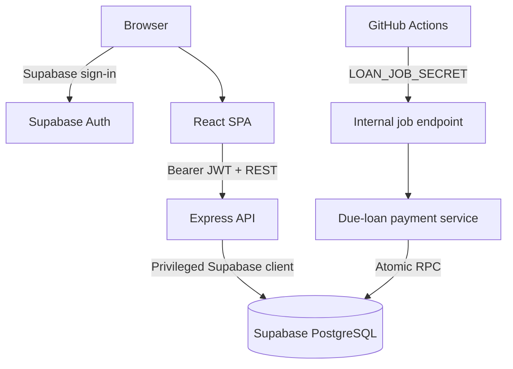

# Architecture

## System overview

Finance Tracker is a personal-finance React application backed by an Express API and Supabase/PostgreSQL.

The repository captures the intended architecture. External deployment state, secrets, and applied database migrations require independent verification.

## Runtime and deployment contract

All three application packages require Node.js `^20.19.0 || >=22.12.0` and carry the private package version `0.9.0` for the first formally tracked baseline.

The repository contains a Vercel SPA rewrite for the client. Backend hosting is provider-neutral in repository configuration; there is no current Railway, Render, or other provider-specific backend descriptor. Production was manually verified on Railway with Node.js 22.23.2. Express trusts the first reverse proxy. Its explicit CORS allowlist contains the local Vite origin and one Vercel client origin, and the deployed Vercel origin was manually verified to match it during the v0.9.0 release review.

The GitHub Actions due-loan workflow runs daily at `07:15` in `Asia/Jerusalem` and supports manual dispatch. GitHub secrets supply `LOAN_JOB_URL` and `LOAN_JOB_SECRET`; the latter is also required by the server endpoint. The latest scheduled production run was manually verified successful during the v0.9.0 release review. Secret values remain external to the repository.

## Frontend

The client is a Vite-built React SPA using React Router. Supabase JS is used in the browser for authentication and session management; feature data normally flows through the Express API via Axios.

### Application shell

- Protected routes wrap the main application pages.
- A shared responsive layout provides desktop and mobile navigation.
- Context providers manage authentication, theme, page-header state, and toast notifications.
- Finance v3 is the current shell and visual system. Finance v2 is historical/intermediate.

### Shared UI system

Finance v3 uses project-owned CSS tokens and reusable components for cards, KPI surfaces, buttons, forms, tabs, dialogs, drawers, bottom sheets, alerts, skeletons, and empty/error states.

Overlay primitives provide portal rendering, Escape and backdrop handling, focus containment, and focus restoration. Domain pages compose these primitives rather than using a large third-party component framework.

### Form and state organization

`useTransactionForm` centralizes much of Add/Edit Transaction state, reference-data loading, payload shaping, and edit hydration. Other modules generally combine local page state with functions from the shared API service.

### RTL and bidi behavior

The interface is RTL-first. Numeric values, codes, installment progress, and other technical content use deliberate LTR/bidi isolation so visual order does not depend on surrounding Hebrew text. This behavior is part of the design system, not a data reversal.

## Backend

The server is a CommonJS Express application organized into:

- **routes** for HTTP endpoints and route-specific middleware;
- **controllers** for validation and orchestration;
- **services** for domain operations such as amortization and due-loan processing;
- **middleware** for Supabase authentication, API keys, and job-secret protection; and
- **utilities** for reusable pricing and transaction-query rules.

Normal application routes validate a Supabase bearer token. The external transaction API uses a separate API key. The scheduled loan endpoint uses a dedicated job secret and is not an ordinary authenticated-user endpoint.

Canonical server tests are discovered recursively by a repository-owned Node launcher. Files named `*.local.test.js` are intentionally excluded because they may accompany ignored operational artifacts. A test-only bootstrap supplies fake configuration values without weakening production startup requirements or contacting live services.

### Node responsibilities

Node currently owns:

- HTTP input validation and response handling;
- orchestration across tables and services;
- fixed and variable loan amortization component calculation;
- transaction item and discount pricing;
- import parsing and category inference;
- Rebrickable API integration;
- due-loan eligibility selection and Asia/Jerusalem business-date handling; and
- UI-oriented response shaping, including loan summaries and details.

### PostgreSQL responsibilities

PostgreSQL owns consistency-sensitive operations including:

- atomic transaction and `loan_payments` mutations;
- loan summary refresh and compatibility triggers;
- loan-payment uniqueness and component reconciliation;
- due-payment locking and idempotency;
- manual schedule-transition persistence and reversal;
- keyset transaction pagination; and
- dashboard summary/monthly-series aggregation.

This division is intentional: Node calculates and orchestrates, while PostgreSQL protects important financial mutation boundaries. Not every surrounding side effect is inside the same database transaction.

## Transactions

`transactions` is the cash and credit-card ledger.

### Amount models

- A direct transaction stores the entered total.
- An itemized transaction calculates amounts using integer minor units to avoid unsafe binary floating-point behavior.
- Transaction items retain their own price, discount, and optional LEGO metadata.
- Transaction-level discounts are allocated across eligible items to derive consistent costs.

### Installments

Ordinary non-loan card installments may generate future sibling transaction rows. Loan-linked transactions deliberately do not: a future loan payment is not an actual ledger event.

### Loan links

`transactions.loan_id` records a relationship only. It does not prove that the transaction is an authoritative installment. This permits ancillary expenses and account-funding transfers to remain loan-related without reducing principal.

The Add/Edit Transaction flow distinguishes:

- **link only**, which changes the ledger relationship but creates no `loan_payments` row; and
- **manual repayment**, which atomically updates the ledger transaction and one authoritative payment row.

### Mutation boundary

The core manual loan-payment mutation is atomic through PostgreSQL RPCs. Item insertion, LEGO synchronization, learned category keywords, and some sibling operations are orchestrated separately. A failure outside the core RPC can therefore leave a partially completed rich transaction workflow.

## Loans

### Core tables

- `loans` stores contractual data, displayed summary state, schedule metadata, status, calculation mode, payment source, automation state, closure date, and indexation metadata.
- `loan_payments` stores authoritative accounting events and optional links to ledger transactions.

### Calculation modes

- `legacy` preserves the historical calculation based on linked transaction totals and counts.
- `loan_payments` derives outstanding principal from authoritative principal and explicit balance-adjustment components.

The compatibility layer allows existing loans to remain unchanged until deliberately migrated.

### Accounting event types

The current model supports:

- regular installments;
- catch-up payments covering multiple contractual obligations;
- irregular historical cash with unknown allocation;
- provider balance adjustments with no cash event; and
- early payoff without inventing the remaining contractual installments.

Cash reconciliation uses payment, principal, interest, and other cash components. A balance adjustment affects outstanding principal but is not cash.

### Summary refresh

`refresh_loan_summary()` and the loan-payment trigger maintain current balance, contractual coverage, remaining installments, paid status, automation state, next payment date, and closure date according to the selected mode and event history.

Interest does not directly reduce principal. Ancillary loan transactions with no payment row do not affect balance or installment progress.

### Manual repayments

Manual repayment RPCs:

- lock and revalidate the loan;
- allocate the next installment on the server/database side;
- reconcile principal, interest, and other components;
- create, update, remove, or move one transaction/payment pair atomically; and
- persist `scheduled_due_date` and `next_scheduled_due_date` snapshots.

The schedule snapshots make deletion, conversion back to link-only, and loan moves reversible without inferring bank dates from the transaction posting date.

### Automatic due payments

The GitHub Actions workflow calls a protected internal endpoint daily. The due-loan service:

- resolves the date in Asia/Jerusalem;
- selects active, enabled, due `loan_payments`-mode loans;
- calculates principal and interest in Node using decimal-safe rules; and
- calls an atomic, locking, idempotent PostgreSQL RPC for one current installment.

The processor never generates future installments beyond the currently due payment. CPI-indexed loans are skipped because a live CPI calculation engine does not yet exist.

## LEGO accounting and collection synchronization

`lego_sets` represents the collection. LEGO-aware transaction items can carry set number, theme, piece count, image, and acquisition metadata.

The current model:

- uses `purchase`, `gift`, and `gwp` as canonical acquisition types;
- records receipt price, allocated transaction-level discount, and resulting purchase cost;
- obtains metadata through Rebrickable when available; and
- synchronizes missing collection entries from transaction items.

Some collection uniqueness and synchronization behavior remains application-enforced and is not atomically coupled to every transaction mutation.

## Pagination and dashboard aggregation

Migration 003 moved expensive list and summary work into PostgreSQL:

- strict keyset pagination replaces offset pagination for transaction pages;
- opaque cursors preserve exact amount/date/id ordering;
- filtered aggregate totals accompany result pages; and
- dashboard KPI/monthly-series RPCs replace large client-side loads.

This reduces transferred data and avoids offset drift as transaction history grows.

## Import and external ingestion

Spreadsheet import supports known bank/card profiles, preview, categorization, and accepted-row persistence. The external v1 API validates a simpler transaction payload, supports external-ID duplicate detection, and resolves selected reference data. Its public request accepts `tags` as `string[]`; Node validates each value and explicitly serializes the array to the existing comma-separated `transactions.tags` TEXT representation. Commas inside one tag are unsupported because this storage model has no escaping convention.

These are distinct ingestion paths. They do not automatically inherit every item, LEGO, loan-payment, keyword-learning, and installment side effect of Add Transaction.

## Shopping checkout

Shopping checkout calculates the purchased-item total, creates a financial transaction, creates a checkout record, and updates list state. These are separate Supabase calls rather than one PostgreSQL transaction. The UI guards duplicate submissions, but server-side partial completion remains a documented boundary.

## Security model

- Supabase Auth protects normal browser/API use.
- Express verifies authenticated requests before normal feature routes.
- A dedicated API key protects external transaction ingestion.
- A dedicated secret protects the internal due-loan endpoint.
- The server uses privileged Supabase access.
- Sensitive loan RPC entry points are narrowly granted; internal helpers are revoked from direct public/client-role execution.
- RLS exists on several financial tables, with legacy permissive policies in parts of the schema.

The application is effectively single-user. Financial tables do not contain a per-user ownership key, so the current design must not be described as multi-tenant row isolation.

## Database evolution

Ordered migrations in `server/migrations/` are schema history. `server/full_schema.sql` is the consolidated intended-schema reference.

Migration 016 canonicalizes three external-ingestion prerequisites that existed in production before they entered repository history: nullable `transactions.external_id`, its partial unique index, and `get_unique_tags()`. The canonical autocomplete function is a `SECURITY INVOKER` read RPC executable directly only by the service-role backend.

There is currently no canonical repository migration runner or applied-migration ledger. A read-only production catalog verification on 2026-08-15 confirmed expected object state through Migration 015; Migration 016 was subsequently applied and independently verified read-only. Neither verification created an execution ledger. Consequently:

- repository history can establish what a migration intends;
- repository history alone cannot establish what is applied to production;
- ordered migration testing remains necessary; and
- external database state must be verified before release or repair work.

## Known architectural boundaries

- Legacy and principal-aware loan calculations coexist.
- CPI-indexed loans cannot be generated automatically.
- Rich transaction and shopping mutations are not uniformly atomic end to end.
- Import/external ingestion behavior is not identical to interactive transaction entry.
- The security/data model is effectively single-user.
- Deployment, migration, backup, and recovery state is partly operational rather than repository-recorded.
