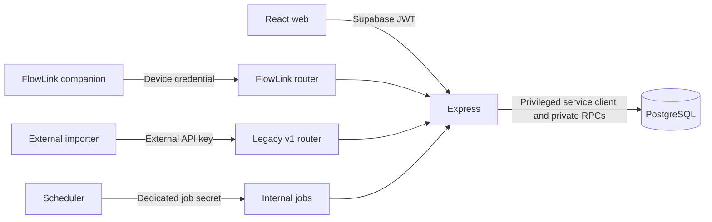

# Architecture

Current source overview at v1.4.0 / migrations 001-038, audited for #46 on
2026-09-28. [Documentation authority and release boundaries](../README.md) separate
implemented foundations from unaccepted Wallet functionality. The
[previous overview](../history/ARCHITECTURE_2026_09_15.md) preserves migration-era
history; [technical decisions](DECISIONS.md) preserve the rationale.

## Runtime and trust boundaries

[server/index.js](../../server/index.js) mounts Apple and FlowLink routers before
its general logger/parser/JWT boundary; these routers own their narrow validation,
authorization, body limits and safe diagnostics. External v1 and internal job routes
also have dedicated authority. Normal application routes use Supabase bearer auth.

The privileged Supabase client can bypass RLS. Existing single-owner financial data
must not be described as tenant-isolated. FlowLink's approved-owner UUID gate and
device/binding authorization are narrower capabilities, not multi-user financial
ownership. Multi-user #63 is deferred to v2.0.0; local #64 drafts are unaccepted.

[Development operations](../operations/DEVELOPMENT.md) owns runtime commands,
configuration, CORS/deployment entry points and scheduler setup. GitHub deployment
statuses do not establish live flag values or additional runtime acceptance.

## Frontend and native responsibilities

[client/src/App.jsx](../../client/src/App.jsx) maps normal routes into the shared
protected Layout; Add/Edit Transaction share the same editor and
[useTransactionForm](../../client/src/hooks/useTransactionForm.js). Components/ui,
styles/tokens.css and page CSS own the Hebrew RTL, light/dark responsive interface.
Technical money/date values use deliberate bidi isolation; money is never reversed.

Page-local state and [api.js](../../client/src/services/api.js) are supplemented by
finance/LEGO invalidation events. Transactions use keyset pagination and fresh reads
on editor return. The validated URL contract in
[transactionsNavigation.js](../../client/src/utils/transactionsNavigation.js) carries
ordinary filters separately from Budget origin; see [Budget navigation](BUDGET_TRANSACTION_CONTEXT.md).

[FlowLink](../../ios/FlowLink/README.md) contains SwiftUI, Keychain credentials,
URLSession, App Intent inputs and durable SQLite capture receipts. Its app version
is independent. Device/card binding identity is server-owned; a queued capture
freezes amount, merchant, date, binding and idempotency key across transport retries.
Real-charge and locked-device behavior are not accepted merely because code/tests
exist. No CAL transition, notification infrastructure or app distribution is implied.

## Financial authorities

| Domain | Authority and invariant | Code / contract |
| --- | --- | --- |
| Transactions | Canonical cash/card rows; exclude voided cash from live readers. Item pricing uses exact minor units; ordinary installments may expand siblings, Loan links alone do not imply repayment. | [transactionController](../../server/controllers/transactionController.js), [pricing](../../server/utils/transactionPricing.js) |
| Loans | loan_payments is principal-aware accounting; legacy calculation remains supported. Manual/due/payoff/irregular commands lock and reconcile in PostgreSQL. Ancillary linked cash is not principal. | [loanPaymentService](../../server/services/loanPaymentService.js), migrations 008-015 |
| Budget | Funding entries change available envelope; movements allocate it; operations/items explain decisions, not another money total. Actuals derive from eligible canonical transactions. | [budgetService](../../server/services/budgetService.js), migrations 017-028 |
| Savings | Named account/entry ledger is held balance and realized interest; linked transactions alone are cash. Immutable reversals/replacements, void guards and occurrence claims protect history. | [Savings contract](SAVINGS_V1_3_0_SPEC.md), migrations 030-035 |
| APY | Sources and observations provide provenance/idempotency; transactions remain the financial record. Attachment creates no second cash event. | [APY contract](APPLE_PAY_TRANSACTION_RECONCILIATION.md), migration 036 |
| FlowLink | Device credentials and immutable card bindings authorize one APY source; money-time authorization is atomic with ingestion. | [native contract](FLOWLINK_NATIVE_INGESTION_CONTRACT.md), migrations 037-038 |

Exact decimal/minor-unit semantics are preserved at authoritative boundaries;
visual chart geometry is not financial identity. Do not sum observation or operation
item amounts into financial totals, or treat reconciliation status as cash eligibility.

## Budget and Savings

The consolidated Budget model uses eleven physical tables and nine canonical views.
`budget_operations` is the universal action header; `budget_operation_items` holds
approval-time facts. Migrations 024-025 retire empty feature-specific tables and
bridge views from earlier generations; their old names are history, not current
extension points. Recurring/default/month overrides are configuration rather than
funding. Initial openings remain immutable; later changes are movements.

Available funding equals category allocation plus unallocated funds. Preview/apply
commands validate exact source capacity, lifecycle restrictions and stale approval
fingerprints under the established transaction/month/account lock order. Deficit
resolution and creation/reactivation of an unbudgeted category remain different
operations. Both can support partial allocation without changing actual spending.

Named Savings and the legacy retained reserve remain distinct. A typed funded
Savings transfer reduces Budget funding/allocation once and creates linked cash
and a deposit atomically; only its explicit provenance excludes that cash from Budget
actuals. Ordinary deposits remain expenses there. Reporting separates all-time held
balance, effective-date ledger flows and transaction-date cash; never double-add them.
See the Savings specification and [historical integrated runbook](../history/RELEASE_1_3_0.md)
for exact command inventories and recovery limits.

## Ingestion and side effects

Manual transactions, spreadsheet import, Shopping checkout and legacy v1 external
API remain distinct entry points. Import does not inherit every item/LEGO/keyword,
Loan or installment side effect. Shopping checkout and rich transaction side effects
still include multi-call boundaries; no cleanup here makes them atomic.

Legacy `/api/v1/transactions` retains its external_id request/duplicate behavior.
External tags are arrays at the API and serialized to existing comma-separated TEXT;
commas inside an individual tag are unsupported. APY's shared
[transactionIngestionService](../../server/services/transactionIngestionService.js)
uses atomic private commands and retains a legacy compatibility mirror. The CAL
producer has not been transitioned by the presence of this foundation.

Source-instance plus idempotency key identifies a delivery; optional provider reference
and non-unique candidate evidence do not replace it. Matching uses exact money,
resolved payment source and conservative merchant/time evidence. An ambiguous
observation with plausible existing purchases remains pending without avoidable new
cash. Voided identity is not silently resurrected. Later attachments preserve user
fields and do not replay Savings/Loan/item/LEGO side effects.

Apple's transitional HTTP adapter and native FlowLink reuse this foundation. The
complex Shortcut UX is superseded; neither ingestion flag is enabled by documentation
or release publication. Approved native bindings resolve payment sources server-side;
physical last4 or a Wallet display label is not authorization.

## Other domains and readers

LEGO collection cost allocation preserves purchase/gift/GWP distinctions and optional
Rebrickable metadata. Collection synchronization is not atomically coupled to every
transaction workflow. Shopping lists/catalog/checkout and Tasks have separate
controllers/routes. Settings owns categories, payment sources, Budget defaults,
Shopping catalog and owner FlowLink management.

Transaction filtering/aggregates and Dashboard use PostgreSQL readers; Savings
reporting is a separate consistent query, not a client sum of every account history.
Annual Budget and cash views have different meanings. Search, import previews,
exports and domain detail reads must retain their existing filters and void rules.

## Database and verification boundaries

[Database guidance](../operations/DATABASE.md) distinguishes immutable incremental
migrations, the consolidated reference and read-only stage checks. There is no
canonical applied-migration ledger or verified universal clean-install runner.
Tests use both controlled consolidated schemas and explicit ordered upgrade stages;
one does not establish the other. Historical production claims retain their original
owner evidence; this cleanup neither queries nor modifies production.

The main accounting risks retained for focused future work are non-atomic rich
transaction/Shopping side effects, legacy Loan compatibility, CPI-indexed Loans
excluded from automatic generation, incomplete external-adapter convergence and
single-owner financial authorization. File organization does not resolve these risks.
